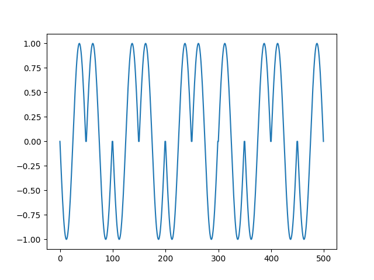
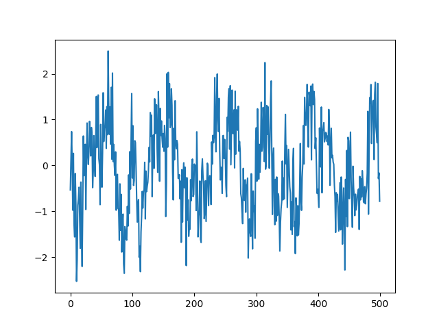
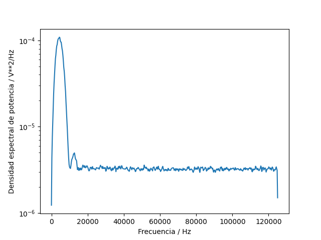
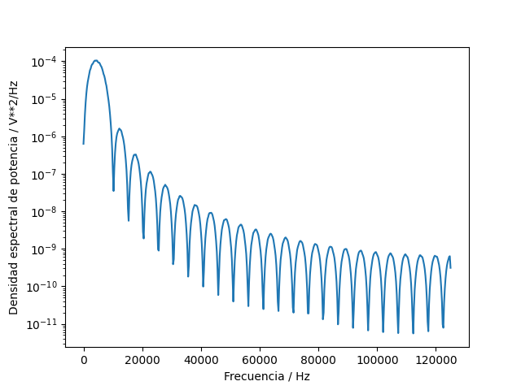
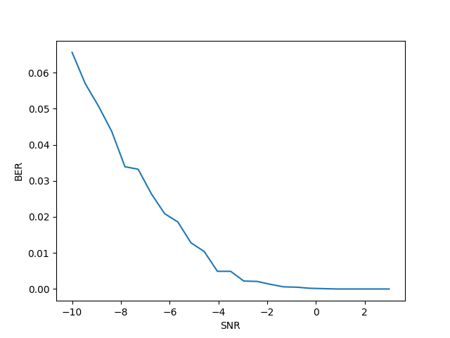

# Trabajo Escrito

## Resultados finales:

* Punto 1:

La modulacion BPSK para los bits presentados se realizo mediante el siguiente 'for loop':

for k, b in enumerate(bits):

senal(k*p:(k+1)*p) = ((2*b)-1) * sinus

Donde (2*b-1) es una funcion que devuelve 1 cuando b es 1 y devuelve -1 cuando b es cero. De esta manera, la senal va a ser seno cuando llega un 1, y va a ser
-seno cuando llega un 0.

Los primeros 10 bits del resultado se muestran en la siguiente figura:

* Punto 2:

Usando la formula proporcionada en clase:

Pinst = senal**2

Ps = integrate.trapz(Pinst, t) / (N * T)

se obtuvo un valor de 0,49 W para la potencia promedio.

* Punto 3 y 4:

Para este punto se simulo un canal ruidoso tipo AWGN desde -10 hasta 3 dB en vez de -2 hasta 3 dB para apreciar mejor el efecto del ruido en la frecuencia de error
generada. Se generaron 25 canales ruidosos que van desde los -10 dB hasta los 3 dB. Para cada valor, se genero la grafica de densidad espectral y la grafica de (senal + ruido).

Para proporcionar un ejemplo, cuando el SNR era de 0,83 dB, asi se veia la senal:

Y para esos niveles de ruido, asi se veia la grafica de densidad espectral de potencia:

Y antes del ruido se veia de la siguiente forma:

* Punto 5:

Se realizo una decodificacion de la senal por deteccion de energia con un umbral del 50% de la energia de la senal sin ruido ya que asi se realizo en clase:

Es = np.sum(sinus**2)

for k, b in enumerate(bits):

Ep = np.sum(Rx(k*p:(k+1)*p) * sinus) 

if Ep > Es/2:

  bitsRx(k) = 1

else:

bitsRx(k) = 0

Este proceso se repitio para cada valor en dB del ruido aplicadoy en cada caso se calculo y se guardo los valores de BER:

err = np.sum(np.abs(bits - bitsRx))

BER(l) = err/N

* Punto 6:

Con los valores recopilados del punto anterior, se genero la grafica de BER con respecto a SNR:

